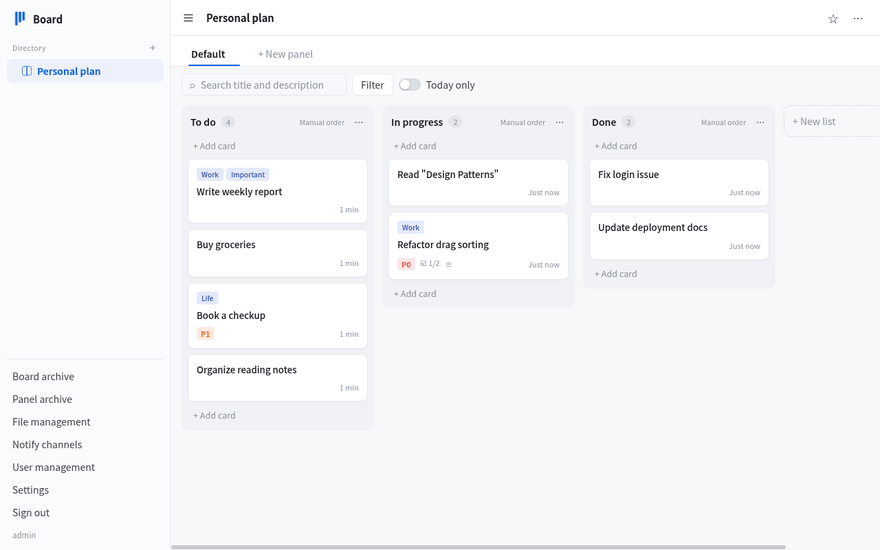
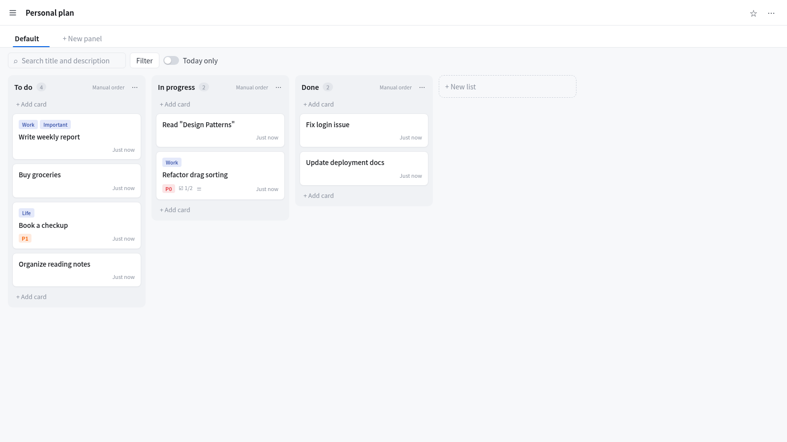
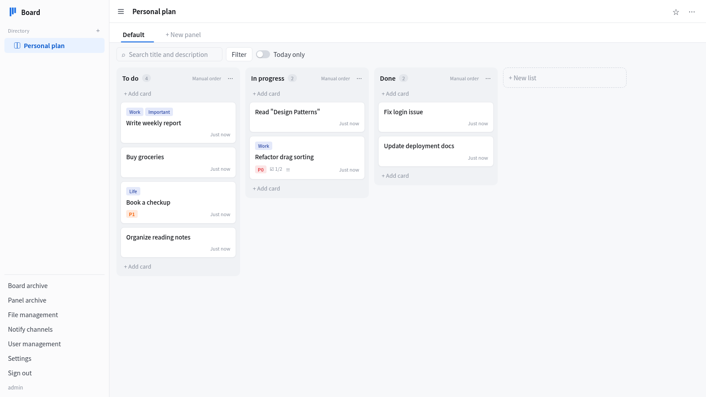
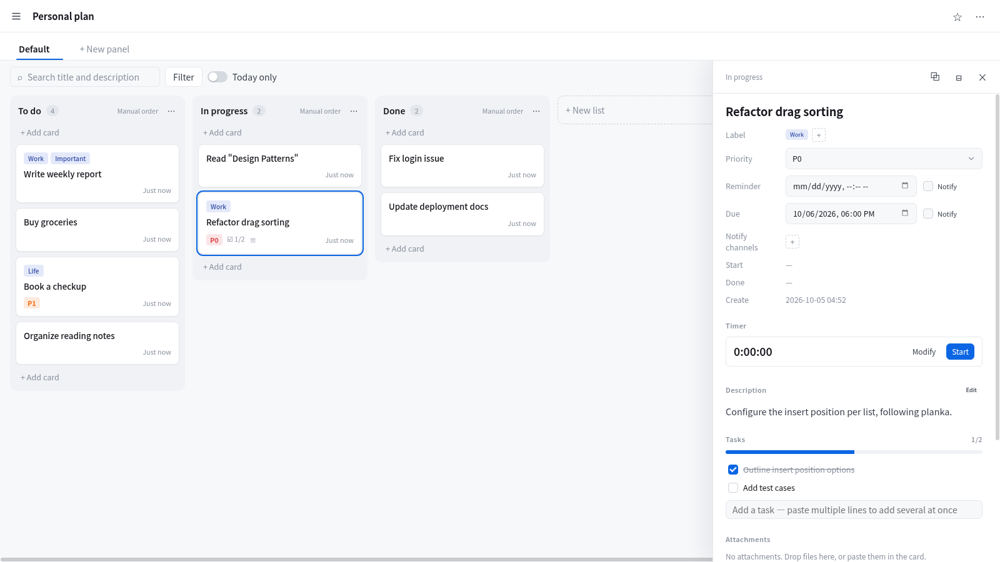
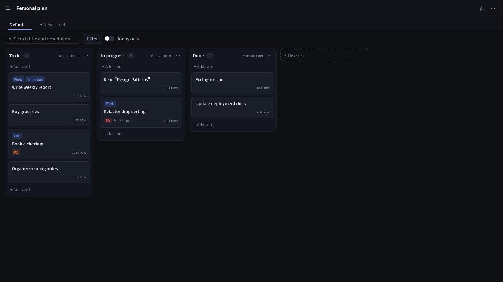
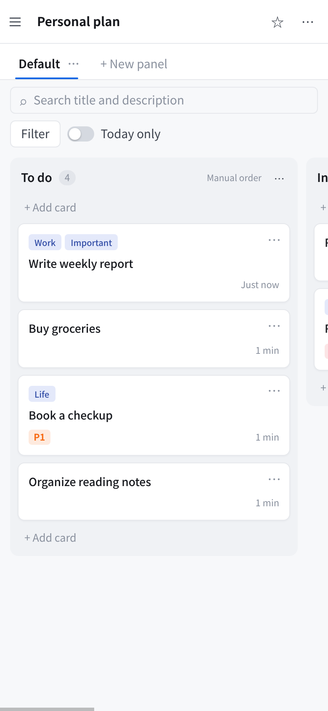

<div align="center">
  <h1>Kanban</h1>
  <p><em>Self-hosted personal planning and todo management</em></p>
  <p>
    <a href="https://go.dev/"></a>
    <a href="https://react.dev/"></a>
    <a href="LICENSE"></a>
  </p>
  <p>
    <strong>English</strong> | <a href="README.zh-CN.md">简体中文</a>
  </p>
  <p>
    <a href="https://www.ksyaki.com/archives/kanban-zi-tuo-guan-de-ge-ren-ji-hua-yu-dai-ban-kan-ban">Blog</a>
  </p>
  <p>
    <a href="#features">Features</a> · <a href="#interface">Interface</a> · <a href="#quick-start">Quick Start</a> · <a href="#configuration">Configuration</a> · <a href="#development">Development</a> · <a href="#notifications">Notifications</a> · <a href="#clients">Clients</a>
  </p>
</div>



Self-hosted personal planning and todo management with a five-level structure: folders, boards, panels, lists and cards. Multi-user with isolated data, real-time sync across devices, designed for desktop, tablet and phone.

## Features

- **Five-level structure**: folders → boards → panels (tabs) → lists → cards; folders nest up to 16 levels, drag to reorder
- **Real-time sync**: every change is pushed over WebSocket to the user's other devices instantly
- **Card content**: Markdown description, multiple labels, priority levels, three-level tasks, attachments (image/PDF/audio/video/text preview), quick links, timer, action log
- **List rules**: create / move-in / move-out of a card can adjust labels and start/finish times; each list sorts independently
- **Remind and due**: notifications are sent through [gmsg](https://github.com/Akvicor/gmsg) when the time arrives; missed ones are delivered after recovery, failures retry automatically
- **Archive system**: boards, panels, lists and cards can each be archived, viewed and restored; archives cannot be emptied
- **File management**: attachments are deduplicated by sha256 with reference counting; unreferenced files are cleaned manually; a file can be referenced only after its full content has been uploaded, and re-uploads by the same user are instant
- **Search and filter**: within a panel by title, description, labels, priorities, members and dates; "today only" dims the rest
- **Responsive + PWA**: layouts for desktop, tablet and phone; add to the home screen for full screen; three themes (Clean / Night / Paper)
- **Chinese & English**: switch the interface language in personal settings, or follow the system; notifications use the same language
- **Multi-user**: the admin creates accounts with isolated data; username, nickname, password, time zone and shortcuts are per user

## Interface

| Board | Sidebar |
| --- | --- |
|  |  |

| Card detail | Night theme |
| --- | --- |
|  |  |

| Phone |
| --- |
|  |

## Quick Start

### Docker Compose (SQLite, simplest)

```bash
git clone https://github.com/Akvicor/kanban
cd kanban
docker compose -f docker-compose.sqlite.yml up -d
```

On first start `data/config.yaml` is generated automatically; the database and attachments live in the `data` directory. Open `http://localhost:3000`.

The image is `ghcr.io/akvicor/kanban` for `linux/amd64` and `linux/arm64`: `latest` points to the newest stable release, or pin a version such as `ghcr.io/akvicor/kanban:v1.2.0`.

### Docker Compose (PostgreSQL)

```bash
cp config.postgres.yaml.example data/config.yaml
# set the database password in data/config.yaml to match docker-compose.postgres.yml
docker compose -f docker-compose.postgres.yml up -d
```

### Binary

Download `kanban-<os>-<arch>.tar.gz` for your system (Linux, macOS; amd64 / arm64) from [Releases](https://github.com/Akvicor/kanban/releases) and extract it, or build from source:

```bash
make build                # produces build/kanban with the frontend embedded
./build/kanban migrate -c ./data/config.yaml   # create or upgrade schema, init admin
./build/kanban server -c ./data/config.yaml
```

> After upgrading, always run `kanban migrate` before starting the server. The server does not upgrade the schema on startup; skipping this step breaks features that use new columns.

### Initial account

`migrate` creates the initial admin from environment variables when the database has no users. Additional accounts are created by the admin on the user management page.

## Configuration

The configuration file is YAML, see [config.sqlite.yaml.example](config.sqlite.yaml.example) (SQLite) or [config.postgres.yaml.example](config.postgres.yaml.example) (PostgreSQL):

| Section | Description |
| --- | --- |
| `server` | listen address, port, HTTPS certificates, frontend directory, trusted reverse proxies |
| `database` | `sqlite` or `postgres` and the matching connection parameters |
| `storage` | directory for attachments, thumbnails and unfinished uploads |
| `log` | log file switch, levels and flags |

Behind a reverse proxy, list the proxy addresses (CIDR or single IP) in `server.trusted-proxies`. The client IP is then read from the `X-Forwarded-For` sent by these proxies, and login rate limiting counts by it; when empty, the connection's source address is used.

All writes are synced to the user's other devices in real time (except device last-active time). A device with no request or sync connection for 90 days is signed out and has to log in again.

## Development

```bash
make dev        # migrate + start the server (debug mode reads frontend files live)
make verify     # frontend tests + backend verification + dependency audit
make format     # format frontend and backend code
```

- `backend/`: Go server — HTTP API, WebSocket sync, gmsg notifications, attachments
- `frontend/`: React + TypeScript + Vite, built assets are embedded into the binary
- Interface texts live in `frontend/src/i18n` (`messages.*.ts` per language); API error codes are mapped in `errors.*.ts` and kept in sync with `backend/.../resp` by `errors.test.ts`

## Notifications

Notifications are sent only through [gmsg](https://github.com/Akvicor/gmsg). Each channel has its own API, token, sign and content format (text / Markdown) and sends with `SendBySign`; the channels page can send a test message. Remind and due bodies are templates with placeholders, and inserted content can be escaped for Markdown channels.

A channel API is the address of a gmsg service (internal addresses are allowed) without `?` or `#`; requests go to `<API>/api/send` and redirects are not followed. Failed sends record only the HTTP status code and the error returned by gmsg.

## Clients

The desktop client for Linux, Windows and macOS lives in the [kanban-app](https://github.com/Akvicor/kanban-app) repository. Its window loads this server's address directly, so the interface updates with the server. The client relies on the following contract; keep kanban-app in sync when changing it:

- The health check `GET /api/sys/info/health` returns 200 with `{"status": "...", "checks": {...}}` (503 when a dependency is not ready); the client uses it to confirm the address is a Kanban server.
- The client appends `KanbanApp/<version>` to the User-Agent; the frontend uses it to show the device as "Desktop app · <system>" (`frontend/src/session/deviceName.ts`).
- The client only grants the clipboard-write and fullscreen web permissions; when the frontend starts using a new browser permission, the client must allow it as well.

## License

This project is released under the [GNU General Public License v3.0](LICENSE).

- Derivative works must be distributed under GPLv3 as well
- Distributing binaries requires providing the complete corresponding source code
- No warranty is provided

See [LICENSE](LICENSE) for the full text.
