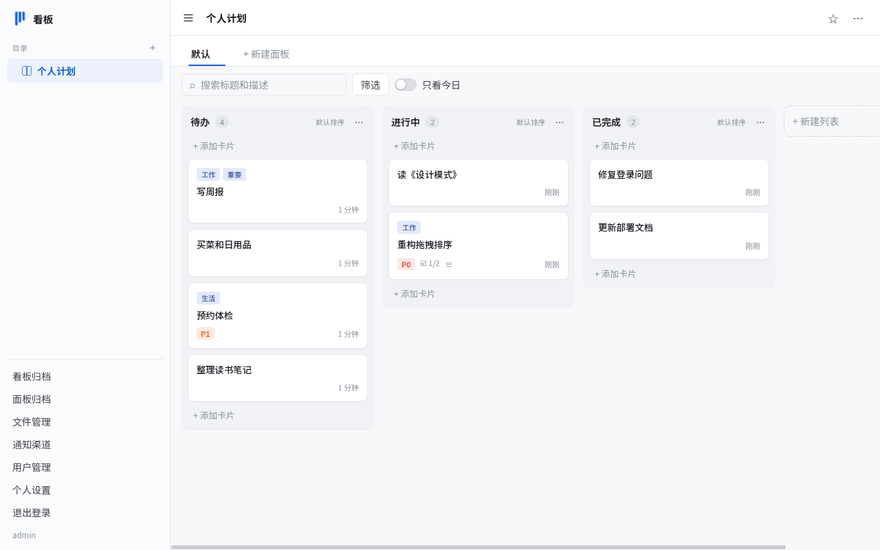
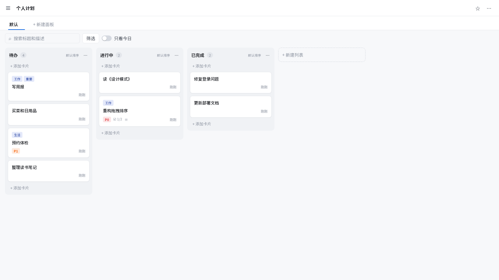
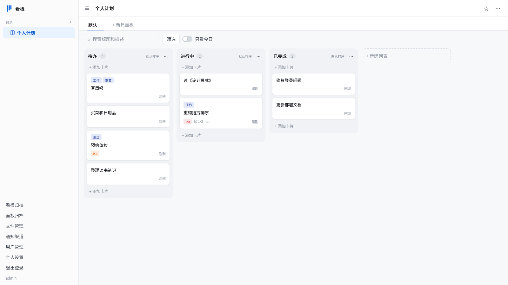
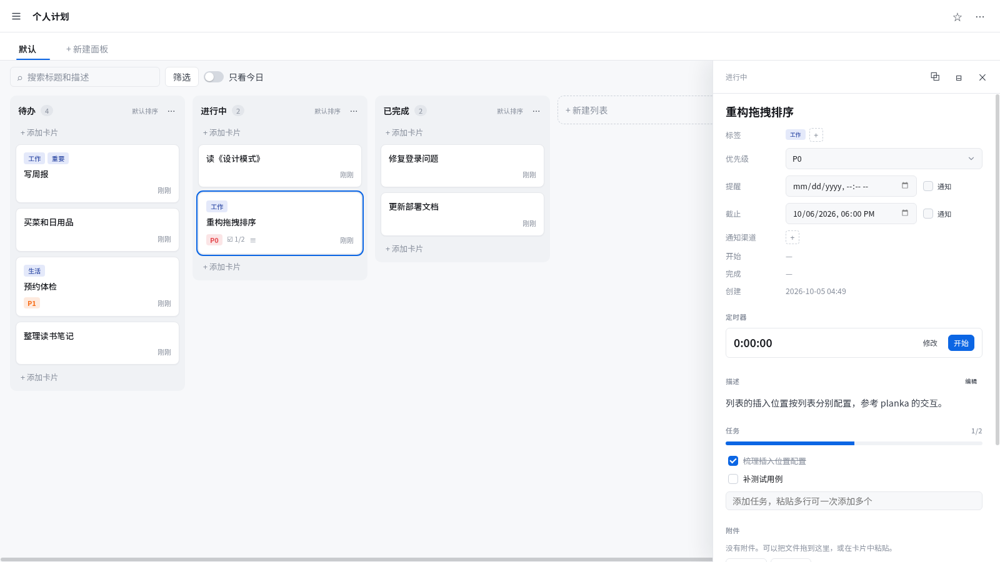
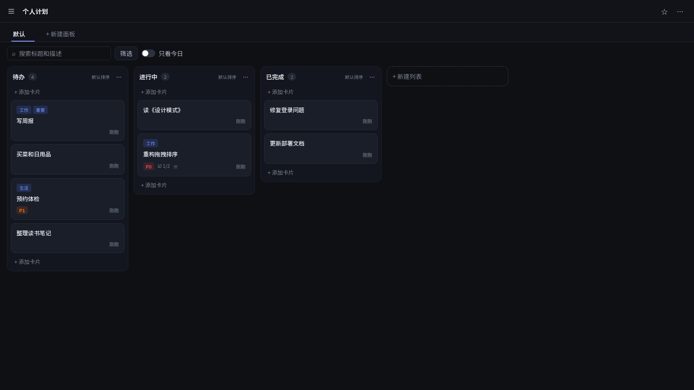
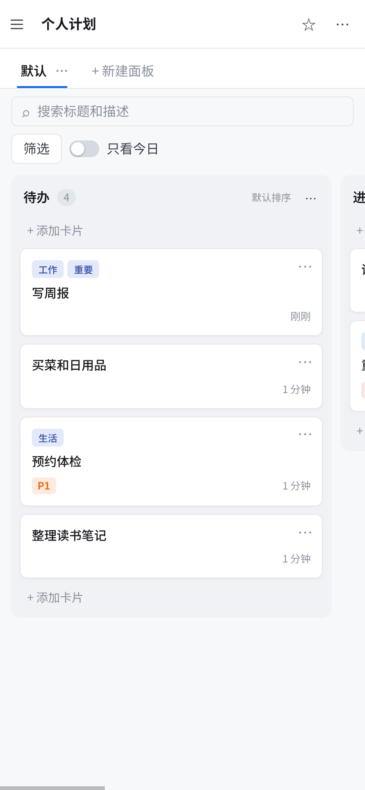

<div align="center">
  <h1>个人看板</h1>
  <p><em>自托管的个人计划与待办管理</em></p>
  <p>
    <a href="https://go.dev/"></a>
    <a href="https://react.dev/"></a>
    <a href="LICENSE"></a>
  </p>
  <p>
    <a href="README.md">English</a> | <strong>简体中文</strong>
  </p>
  <p>
    <a href="#功能">功能</a> · <a href="#界面">界面</a> · <a href="#快速开始">快速开始</a> · <a href="#配置">配置</a> · <a href="#开发">开发</a> · <a href="#通知">通知</a> · <a href="#客户端">客户端</a>
  </p>
</div>



自托管的个人计划与待办管理，文件夹 → 看板 → 面板 → 列表 → 卡片五层结构。多用户数据隔离，多设备实时同步，适配电脑、平板和手机。

## 功能

- **五层结构**：文件夹 → 看板 → 面板（标签页）→ 列表 → 卡片；文件夹可嵌套最多 16 层，拖动调整顺序
- **实时同步**：所有修改通过 WebSocket 立即推送到同一用户的其他设备
- **卡片内容**：Markdown 描述、多选标签、优先级挡位、三层任务、附件（图片/PDF/音视频/文本在线预览）、关联跳转、定时器、操作记录
- **列表规则**：卡片相对列表的创建、移入、移出可配置标签与开始/完成时间的调整动作；列表可分别排序
- **提醒与截止**：到点通过 [gmsg](https://github.com/Akvicor/gmsg) 发送通知，停机错过的恢复后补发，失败自动重试
- **归档体系**：看板、面板、列表、卡片四级归档，进入归档后可查看和恢复，归档不能清空
- **文件管理**：附件按 sha256 全局去重存储，引用计数管理，无引用的文件手动清理；引用文件前需上传过完整内容，同一用户重复上传秒传
- **搜索筛选**：面板内按标题、描述、标签、优先级、成员、日期筛选；「只看今日」把非今日卡片变灰
- **响应式 + PWA**：电脑、平板、手机三档布局，可添加到手机主屏全屏使用；三套配色（清爽 / 暗夜 / 纸感）
- **中英双语**：个人设置中切换界面语言，或跟随系统；通知内容使用相同语言
- **多用户**：管理员创建账号，数据互相隔离；用户名、昵称、密码、时区、快捷键各自可改

## 界面

| 看板 | 目录侧栏 |
| --- | --- |
|  |  |

| 卡片详情 | 暗夜配色 |
| --- | --- |
|  |  |

| 手机 |
| --- |
|  |

## 快速开始

### Docker Compose（SQLite，最简单）

```bash
git clone https://github.com/Akvicor/kanban
cd kanban
docker compose -f docker-compose.sqlite.yml up -d
```

首次启动自动生成 `data/config.yaml`，数据库和附件都放在 `data` 目录。打开 `http://localhost:3000` 即可使用。

镜像为 `ghcr.io/akvicor/kanban`，支持 `linux/amd64`、`linux/arm64`：`latest` 指向最新正式版，也可以指定版本，例如 `ghcr.io/akvicor/kanban:v1.2.0`。

### Docker Compose（PostgreSQL）

```bash
cp config.postgres.yaml.example data/config.yaml
# 修改 data/config.yaml 中的数据库密码，与 docker-compose.postgres.yml 中保持一致
docker compose -f docker-compose.postgres.yml up -d
```

### 二进制运行

在 [Releases](https://github.com/Akvicor/kanban/releases) 下载对应系统的 `kanban-<系统>-<架构>.tar.gz`（Linux、macOS，amd64 / arm64），解压后运行；也可以从源码构建：

```bash
make build                # 产出 build/kanban（前端已嵌入）
./build/kanban migrate -c ./data/config.yaml   # 创建或升级表结构，并初始化管理员
./build/kanban server -c ./data/config.yaml
```

> 升级版本后务必先执行 `kanban migrate` 再启动服务。服务启动时不自动升级表结构，跳过这一步会在使用新增功能时出错。

### 初始账号

`migrate` 在库中没有用户时按环境变量创建初始管理员；之后管理员在「用户管理」中创建其他账号。

## 配置

配置文件为 YAML，参考 [config.sqlite.yaml.example](config.sqlite.yaml.example)（SQLite）或 [config.postgres.yaml.example](config.postgres.yaml.example)（PostgreSQL）：

| 段 | 说明 |
| --- | --- |
| `server` | 监听地址、端口、HTTPS 证书、前端文件目录、受信任的反向代理 |
| `database` | `sqlite` 或 `postgres`，以及对应的连接参数 |
| `storage` | 附件、缩略图和未完成上传的存放目录 |
| `log` | 日志文件开关、级别和输出标志 |

部署在反向代理后时，在 `server.trusted-proxies` 中填写代理的地址（CIDR 或单个 IP）。客户端 IP 从这些代理转发的 `X-Forwarded-For` 中读取，登录限流按它计数；未填写时使用连接的来源地址。

所有写入都实时同步到该用户的其他设备（设备最后活跃时间除外）。设备 90 天内没有任何请求或同步连接时，登录失效，需要重新登录。

## 开发

```bash
make dev        # migrate + 启动服务（debug 模式实时读取前端文件）
make verify     # 前端测试 + 后端验证 + 依赖审计
make format     # 格式化前后端代码
```

- `backend/`：Go 服务，HTTP API、WebSocket 同步、gmsg 通知、附件处理
- `frontend/`：React + TypeScript + Vite，构建产物嵌入二进制
- 界面文案在 `frontend/src/i18n`（`messages.*.ts` 每语言一份）；接口错误码文案在 `errors.*.ts`，由 `errors.test.ts` 与 `backend/.../resp` 的错误码常量比对，保证不漏翻译

## 通知

通知只通过 [gmsg](https://github.com/Akvicor/gmsg) 发送。每条渠道有自己的 API、Token、Sign 和内容格式（文本 / Markdown），发送使用 `SendBySign`；渠道页可发送测试消息。提醒和截止的正文模板支持占位符，Markdown 渠道可对插入内容做转义。

渠道 API 是 gmsg 服务的地址（可以是内网地址），不带 `?` 和 `#`，请求发往 `<API>/api/send` 且不跟随重定向。发送失败时只记录 HTTP 状态码和 gmsg 返回的错误信息。

## 客户端

Linux、Windows、macOS 桌面客户端在 [kanban-app](https://github.com/Akvicor/kanban-app) 仓库中。客户端窗口直接加载本服务器的地址，界面随服务器更新。客户端依赖以下约定，修改时需要同步 kanban-app：

- 健康检查 `GET /api/sys/info/health` 返回 200 和 `{"status": "...", "checks": {...}}`（依赖未就绪时 503），客户端据此确认地址是看板服务器。
- 客户端在 User-Agent 末尾追加 `KanbanApp/<版本>`，前端据此把设备名显示为「桌面客户端 · 系统」（`frontend/src/session/deviceName.ts`）。
- 客户端只放行剪贴板写入和全屏两项网页权限；前端使用新的浏览器权限时，客户端需要同步放行。

## 许可

本项目采用 [GNU General Public License v3.0](LICENSE) 开源协议发布。

- 修改和分发时必须同样以 GPLv3 开源
- 分发二进制时必须提供对应的完整源代码
- 不提供任何担保

协议全文见 [LICENSE](LICENSE)。
